# 分布式事务

[toc]

## 1、Nacos配置

### 1.1、Nacos准备

* 1、下载Nacos压缩包并解压（这里为了方便，简单使用Windows环境）

* 2、执行Nacos脚本

    * 在Nacos/conf目录下有一个`nacos-mysql.sql`脚本文件，并在本地数据库或者环境上执行；

* 3、修改Nacos配置文件
	
	* 在Nacos/conf目录下有一个`application.properties`文件，同时还有一个`application.properties.example`的参考文件，可以参考里面的配置内容来配置，这里直接把修改的内容粘贴出来了：
	
	  ```properties
	  spring.datasource.platform=mysql
	  
	  db.num=1
	  
	  db.url.0=jdbc:mysql://localhost:3306/nacos?characterEncoding=utf8&connectTimeout=1000&socketTimeout=3000&autoReconnect=true&useUnicode=true&useSSL=false&serverTimezone=Asia/Shanghai
	  db.user=root
	  db.password=1qaz@WSX
	  ```
	
	  


### 1.2、Nacos的启动

这里使用简易版的windows环境启动单机Nacos
```text
# 启动nacos
startup.cmd -m standalone

# 关闭nacos
shutdown.cmd
```
如果使用Linux系统的话，执行如下命令
```text
# 启动nacos
sh startup.sh -m standalone

# 关闭nacos
sh shutdown.sh
```

Nacos启动之后，打开浏览器，输入`http://ip:8848/nacos`， 用户名密码默认`nacos/nacos`，就能看到Nacos界面了。


### 1.3、Nacos项目配置

根据每个项目，配置不同的内容，此次省略。但是如果使用`spring-cloud-starter-alibaba-nacos-xxx`的话，Spring和Nacos集成的配置项必须要使用`bootstrap.yml`或者`bootstrap.properties`才行：

```yaml
server:
  port: 8080

spring:
  application:
    name: distributed-tx-seata-bank1
  cloud:
    nacos:
      config:
        server-addr: localhost:8848
        username: nacos
        password: nacos
        namespace: public
        file-extension: yml

# 防止nacos狂刷
logging:
  level:
    com.alibaba.nacos.client: error
```

其余配置项都存放在Nacos上：

```yaml
spring:
  datasource:
    driver-class-name: com.mysql.cj.jdbc.Driver
    url: jdbc:mysql:///distributed-tx-seata-bank1?useSSL=false&useUnicode=true&characterEncoding=UTF-8&allowMultiQueries=true&serverTimezone=Asia/Shanghai
    username: xxxx
    password: xxxx
  jackson:
    date-format: yyyy-MM-dd HH:mm:ss
    time-zone: GMT+8

mybatis-plus:
  configuration:
    # 驼峰下划线转换
    map-underscore-to-camel-case: true
    auto-mapping-behavior: full
    log-impl: org.apache.ibatis.logging.stdout.StdOutImpl
  mapper-locations: classpath*:mapper/**/*Mapper.xml
  global-config:
    # 逻辑删除配置
    db-config:
      # 删除前
      logic-not-delete-value: 1
      # 删除后
      logic-delete-value: 0
  type-aliases-package: com.caychen.seata.bank.entity
```


## 2、分布式事务的前奏

### 2.1、分布式理论基础

- **事务**：事务是由一组操作构成的可靠的独立的工作单元，事务具备ACID的特性，即原子性、一致性、隔离性和持久性。

- **本地事务**：当事务由资源管理器本地管理时被称作本地事务。本地事务的优点就是支持严格的**ACID**特性，高效，可靠，状态可以只在资源管理器中维护，而且应用编程模型简单。但是本地事务不具备分布式事务的处理能力，隔离的最小单位受限于资源管理器。

- **全局事务**：当事务由全局事务管理器进行全局管理时成为全局事务，事务管理器负责管理全局的事务状态和参与的资源，协同资源的一致提交回滚。

- **TX协议**：应用或者应用服务器与事务管理器的接口。

- **XA协议**：全局事务管理器与资源管理器的接口。XA是由X/Open组织提出的分布式事务规范。该规范主要定义了全局事务管理器和局部资源管理器之间的接口。主流的数据库产品都实现了XA接口。XA接口是一个双向的系统接口，在事务管理器以及多个资源管理器之间作为通信桥梁。之所以需要XA是因为在分布式系统中从理论上讲两台机器是无法达到一致性状态的，因此引入一个单点进行协调。由全局事务管理器管理和协调的事务可以跨越多个资源和进程。全局事务管理器一般使用XA二阶段协议与数据库进行交互。

- **AP**：应用程序，可以理解为使用DTP（Data Tools Platform）的程序。

- **RM**：资源管理器，这里可以是一个DBMS或者消息服务器管理系统，应用程序通过资源管理器对资源进行控制，资源必须实现XA定义的接口。资源管理器负责控制和管理实际的资源。

- **TM**：事务管理器，负责协调和管理事务，提供给AP编程接口以及管理资源管理器。事务管理器控制着全局事务，管理事务的生命周期，并且协调资源。

- **两阶段提交协议**：XA用于在全局事务中协调多个资源的机制。TM和RM之间采取两阶段提交的方案来解决一致性问题。两节点提交需要一个协调者（**TM**）来掌控所有参与者（**RM**）节点的操作结果并且指引这些节点是否需要最终提交。两阶段提交的局限在于协议成本，准备阶段的持久成本，全局事务状态的持久成本，潜在故障点多带来的脆弱性，准备后，提交前的故障引发一系列隔离与恢复难题。

- **CAP定理**：对于共享数据系统，最多只能同时拥有**CAP**其中的两个，任意两个都有其适应的场景，真是的业务系统中通常是ACID与CAP的混合体。分布式系统中最重要的是满足业务需求，而不是追求高度抽象，绝对的系统特性。

  - C（**Consistency**）表示一致性，也就是所有用户看到的数据是一样的。
  - A（**Availability**）表示可用性，是指总能找到一个可用的数据副本。
  - P（**Partition tolerance**）表示分区容错性，能够容忍网络中断等故障。

- **BASE理论**：它对**CAP**中一致性和可用性权衡的结果，其来源于对大规模互联网分布式系统实践的总结，是基于CAP定律逐步演化而来。其核心思想是即使无法做到强一致性，但每个应用都可以根据自身业务特点，才用适当的方式来使系统打到最终一致性。

  - BA（**Basically Available**）指的是基本业务可用性，支持分区失败；
  - S（**Soft State**）表示柔性状态，也就是允许短时间内不同步；
  - E（**Eventually Consistent**）表示最终一致性，数据最终是一致的，但是实时是不一致的。
  - 原子性和持久性必须从根本上保障，为了可用性、性能和服务降级的需要，只有降低一致性和隔离性的要求。

- 柔性事务中的服务模式：

  1. 可查询操作：服务操作具有全局唯一的标识，操作唯一的确定的时间。
  2. 幂等操作：重复调用多次产生的业务结果与调用一次产生的结果相同。一是通过业务操作实现幂等性，二是系统缓存所有请求与处理的结果，最后是检测到重复请求之后，自动返回之前的处理结果。
  3. TCC操作：Try阶段，尝试执行业务，完成所有业务的检查，实现一致性；预留必须的业务资源，实现准隔离性。Confirm阶段：真正的去执行业务，不做任何检查，仅适用Try阶段预留的业务资源，Confirm操作还要满足幂等性。Cancel阶段：取消执行业务，释放Try阶段预留的业务资源，Cancel操作要满足幂等性。TCC与2PC(两阶段提交)协议的区别：TCC位于业务服务层而不是资源层，TCC没有单独准备阶段，Try操作兼备资源操作与准备的能力，TCC中Try操作可以灵活的选择业务资源，锁定粒度。TCC的开发成本比2PC高。实际上TCC也属于两阶段操作，但是TCC不等同于2PC操作。
  4. 可补偿操作：Do阶段：真正的执行业务处理，业务处理结果外部可见。Compensate阶段：抵消或者部分撤销正向业务操作的业务结果，补偿操作满足幂等性。约束：补偿操作在业务上可行，由于业务执行结果未隔离或者补偿不完整带来的风险与成本可控。实际上，TCC的Confirm和Cancel操作可以看做是补偿操作。

  

### 2.2、分布式事务产生的原因

#### 2.2.1、数据库的分库分表

讲到事务，又得搬出经典的银行转账问题了，下面以实例说明：

> 假设银行(bank)中有两个客户(name)张三和李四， 我们需要将张三的1000元存款(sal)转到李四的账户上，目标就是张三账户减1000，李四账户加1000，不能出现中间其它步骤(张三减1000，李四没加)。

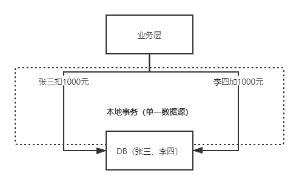

如果两个用户对应的银行存款数据在一个数据源中，即一个数据库中，通过Spring框架下的`@Transactional`注解来保证单一数据源增删改查的一致性，但是随着业务的不断扩大，用户数在不断变多，几百万几千万用户时数据可以存一个库甚至一个表里，假设有10个亿的用户？

为了解决数据库上的瓶颈，分库是很常见的解决方案，不同用户就可能落在不同的数据库里，原来一个库里的事务操作，现在变成了跨数据库的事务操作。

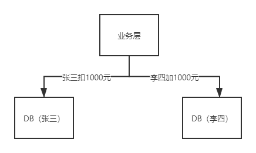

此时`@Transactional`注解就失效了，这就是**跨数据库分布式事务问题**。

当我们的单个数据库的性能产生瓶颈的时候，我们可能会对数据库进行分区，这里所说的分区指的是物理分区，分区之后可能不同的库就处于不同的服务器上了，这个时候单个数据库的ACID已经不能适应这种情况了，而在这种ACID的集群环境下，再想保证集群的ACID几乎是很难达到，或者即使能达到那么效率和性能会大幅下降，最为关键的是再很难扩展新的分区了，这个时候如果再追求集群的ACID会导致我们的系统变得很差。


#### 2.2.2、微服务化的出现

随着业务不断增长，将业务中不同模块服务拆分成微服务后，同时调用多个微服务，同样会产生的分布式事务问题。

微服务化的银行转账情景往往是这样的

1. 调用交易系统服务创建交易订单；
2. 调用支付系统记录支付明细；
3. 调用账务系统执行 A 扣钱；
4. 调用账务系统执行 B 加钱;

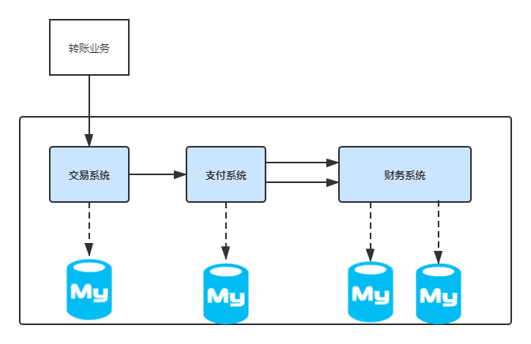

如图所示，每个系统都对应一个独立的数据源，且可能位于不同机房，同时调用多个系统的服务很难保证同时成功，这就是**跨服务分布式事务问题**。


## 3、分布式事务的解决方案

这时我们就需要引入一个新的理论原则来适应这种集群的情况，就是CAP原则或者叫CAP定理。但是在如今的分布式系统中，在任何数据库设计中，一个Web应用至多只能同时支持上面的两个属性。显然，任何横向扩展策略都要依赖于数据分区。因此，设计人员必须在一致性与可用性之间做出选择。

**这个定理在迄今为止的分布式系统中都是适用的！**

解决方案大体可以分为以下几种形式，各形式适用的场景各不相同，意思就是说，**即使当前场景适用，换到其它场景也不一定适用**。

* 2PC：两阶段提交协议

* 3PC：三阶段提交

* TCC事务补偿

* 本地消息表

* 基于可靠消息的最终一致性方案概述（消息事务）

* 最大努力通知


### 3.1、2PC（两阶段提交协议）

#### 3.1.1、理论知识

两阶段协议可以用于单机集中式系统，由事务管理器协调多个资源管理器；也可以用于分布式系统，**「由一个全局的事务管理器协调各个子系统的局部事务管理器完成两阶段提交」**。

这个协议有**「两个角色」**，

* **事务的协调者**；
* **事务的参与者**。

事务的提交又分成两个阶段：

* **投票阶段**：协调者将通知事务参与者准备提交或取消事务，然后进入表决过程。参与者将告知协调者自己的决策：同意（事务参与者本地事务执行成功，但未提交）或取消（本地事务执行故障）
* **决定阶段**：收到参与者的通知后，协调者再向参与者发出通知，根据反馈情况决定各参与者是否要提交还是回滚；

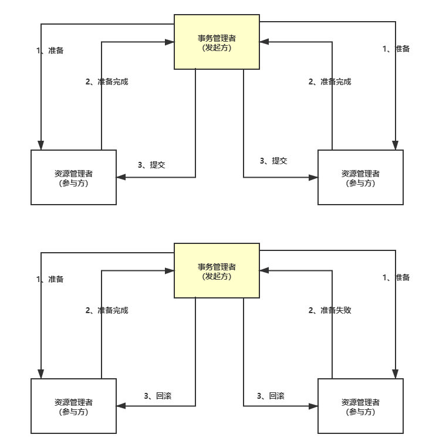

##### 3.1.1.1、投票阶段

第一个阶段是**「投票阶段」**。

- 1、协调者首先将命令**「写入日志」**；
- 2、**「发一个prepare命令」**给 B 和 C 节点这两个参与者；
- 3、B和C收到消息后，根据自己的实际情况，**「判断自己的实际情况是否可以提交」**；
- 4、将处理结果**「记录到日志」**系统；
- 5、将结果**「返回」**给协调者；

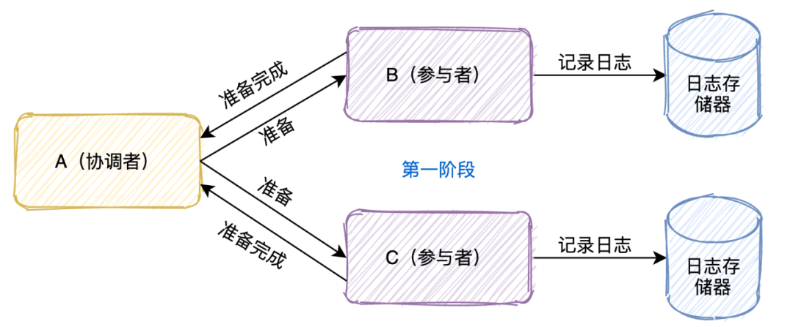


##### 3.1.1.2、决定阶段/提交阶段

第二个阶段是**「决定阶段」**。

当 A 节点收到 B 和 C 参与者所有的确认消息后：

- 1、**「判断」**所有协调者**「是否都可以提交」**；
  - 如果可以则**「写入日志」**并且发起commit命令
  - 有一个不可以则**「写入日志」**并且发起abort命令
- 2、参与者收到协调者发起的命令，**「执行命令」**；
- 3、将执行命令及结果**「写入日志」**；
- 4、**「返回结果」**给协调者；

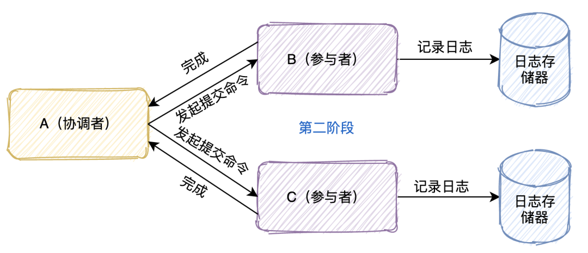


#### 3.1.2、可能会存在哪些问题？

- **「单点故障」**：一旦事务管理器出现故障，整个系统不可用
- **「数据不一致」**：在阶段二，如果事务管理器只发送了部分 commit 消息，此时网络发生异常，那么只有部分参与者接收到 commit 消息，也就是说只有部分参与者提交了事务，使得系统数据不一致。
- **「响应时间较长」**：整个消息链路是串行的，要等待响应结果，不适合高并发的场景
- **「不确定性」**：当事务管理器发送 commit 之后，并且此时只有一个参与者收到了 commit，那么当该参与者与事务管理器同时宕机之后，重新选举的事务管理器无法确定该条消息是否提交成功。


#### 3.1.3、实践：使用Seata实现2PC

##### 3.1.3.1、下载Seata-Server文件

附上Seata项目的[Github链接](https://github.com/seata)，以及[官网文档链接](https://seata.io/zh-cn/index.html)，其中seata的脚本和配置文件都在其他版本的[script目录下](https://github.com/seata/seata/tree/develop/script)。

##### 3.1.3.2、修改Seata的配置文件registry.conf

修改registry.conf之前请先备份好原始文件，以免修改错误无法回滚。

```json
registry {
  # file 、nacos 、eureka、redis、zk、consul、etcd3、sofa
  type = "nacos"

  nacos {
    application = "seata-server"
    serverAddr = "127.0.0.1:8848"
    group = "SEATA_GROUP"
    namespace = ""
    cluster = "default"
    username = "nacos"
    password = "nacos"
  }
}

config {
  # file、nacos 、apollo、zk、consul、etcd3
  type = "nacos"

  nacos {
    serverAddr = "127.0.0.1:8848"
    namespace = ""
    group = "SEATA_GROUP"
    username = "nacos"
    password = "nacos"
    dataId = "seataServer.properties"
  }
}
```

##### 3.1.3.3、推送Seata配置到Nacos

* 拉取配置文件：

```text
https://github.com/seata/seata/blob/develop/script/config-center/config.txt
```

* 拉取推送脚本：

```text
https://github.com/seata/seata/blob/develop/script/config-center/nacos/nacos-config.sh
```

* 修改config.txt

```properties
#my_test_tx_group需要与客户端保持一致  default需要和服务端registry.conf中registry中的cluster保持一致
service.vgroupMapping.my_test_tx_group=default
store.mode=db
store.db.datasource=druid
store.db.dbType=mysql
store.db.driverClassName=com.mysql.cj.jdbc.Driver
store.db.url=jdbc:mysql://127.0.0.1:3306/seata?useSSL=false&useUnicode=true&characterEncoding=UTF-8&allowMultiQueries=true&serverTimezone=Asia/Shanghai
store.db.user=root
store.db.password=1qaz@WSX
store.db.minConn=5
store.db.maxConn=30
store.db.globalTable=global_table
store.db.branchTable=branch_table
store.db.queryLimit=100
store.db.lockTable=lock_table
store.db.maxWait=5000
```

* 将config.txt保存到Seata解压的根目录，并推送到Nacos中（Linux直接使用Shell推送，Windows可以借助Gitbash进行推送）

```text
sh nacos-config.sh -h 127.0.0.1
```

* 打开Nacos地址，能看到Seata的配置文件已经推送到了Nacos服务器上，如图所示：

  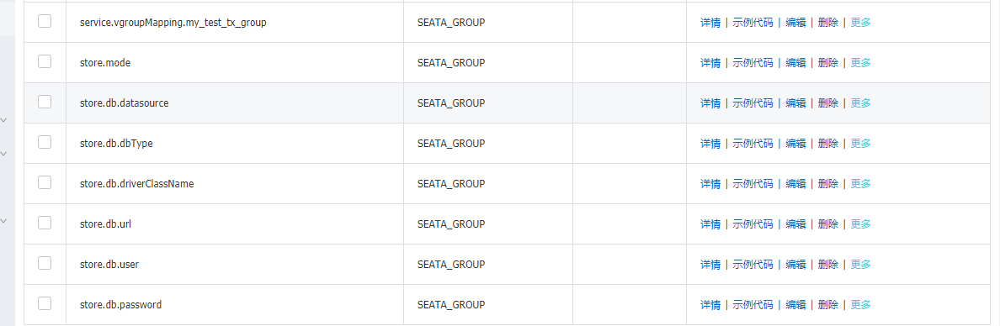


##### 3.1.3.4、重启Seata-Server

注意config.txt文件目录，默认放在解压的根目录下，而不是在seata-server-xxx目录下。如果重启成功，可以在Nacos上看到seata-server服务列表：

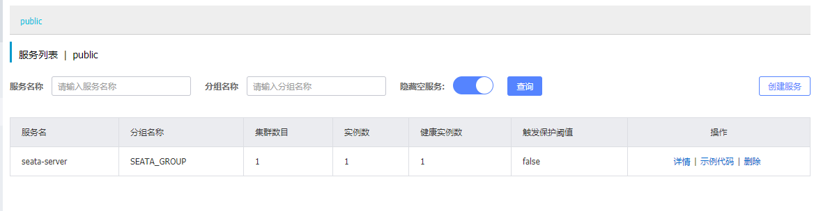

##### 3.1.3.5、执行sql脚本

* 1、创建一个seata库，执行如下脚本：

```sql
create database seata character set utf8mb4;

-- -------------------------------- The script used when storeMode is 'db' --------------------------------
-- the table to store GlobalSession data
CREATE TABLE IF NOT EXISTS `global_table`
(
    `xid`                       VARCHAR(128) NOT NULL,
    `transaction_id`            BIGINT,
    `status`                    TINYINT      NOT NULL,
    `application_id`            VARCHAR(32),
    `transaction_service_group` VARCHAR(32),
    `transaction_name`          VARCHAR(128),
    `timeout`                   INT,
    `begin_time`                BIGINT,
    `application_data`          VARCHAR(2000),
    `gmt_create`                DATETIME,
    `gmt_modified`              DATETIME,
    PRIMARY KEY (`xid`),
    KEY `idx_gmt_modified_status` (`gmt_modified`, `status`),
    KEY `idx_transaction_id` (`transaction_id`)
    ) ENGINE = InnoDB
    DEFAULT CHARSET = utf8;

-- the table to store BranchSession data
CREATE TABLE IF NOT EXISTS `branch_table`
(
    `branch_id`         BIGINT       NOT NULL,
    `xid`               VARCHAR(128) NOT NULL,
    `transaction_id`    BIGINT,
    `resource_group_id` VARCHAR(32),
    `resource_id`       VARCHAR(256),
    `branch_type`       VARCHAR(8),
    `status`            TINYINT,
    `client_id`         VARCHAR(64),
    `application_data`  VARCHAR(2000),
    `gmt_create`        DATETIME(6),
    `gmt_modified`      DATETIME(6),
    PRIMARY KEY (`branch_id`),
    KEY `idx_xid` (`xid`)
    ) ENGINE = InnoDB
    DEFAULT CHARSET = utf8;

-- the table to store lock data
CREATE TABLE IF NOT EXISTS `lock_table`
(
    `row_key`        VARCHAR(128) NOT NULL,
    `xid`            VARCHAR(128),
    `transaction_id` BIGINT,
    `branch_id`      BIGINT       NOT NULL,
    `resource_id`    VARCHAR(256),
    `table_name`     VARCHAR(32),
    `pk`             VARCHAR(36),
    `gmt_create`     DATETIME,
    `gmt_modified`   DATETIME,
    PRIMARY KEY (`row_key`),
    KEY `idx_branch_id` (`branch_id`)
    ) ENGINE = InnoDB
    DEFAULT CHARSET = utf8;
```

* 2、在每个业务库中执行undo日志的脚本文件：

```sql
-- for AT mode you must to init this sql for you business database. the seata server not need it.
CREATE TABLE IF NOT EXISTS `undo_log`
(
    `branch_id`     BIGINT       NOT NULL COMMENT 'branch transaction id',
    `xid`           VARCHAR(128) NOT NULL COMMENT 'global transaction id',
    `context`       VARCHAR(128) NOT NULL COMMENT 'undo_log context,such as serialization',
    `rollback_info` LONGBLOB     NOT NULL COMMENT 'rollback info',
    `log_status`    INT(11)      NOT NULL COMMENT '0:normal status,1:defense status',
    `log_created`   DATETIME(6)  NOT NULL COMMENT 'create datetime',
    `log_modified`  DATETIME(6)  NOT NULL COMMENT 'modify datetime',
    UNIQUE KEY `ux_undo_log` (`xid`, `branch_id`)
    ) ENGINE = InnoDB
    AUTO_INCREMENT = 1
    DEFAULT CHARSET = utf8 COMMENT ='AT transaction mode undo table';
```

该两个文件已存放在项目根目录的sql/seata的目录中。


##### 3.1.3.6、将registry.conf复制到项目的资源目录下

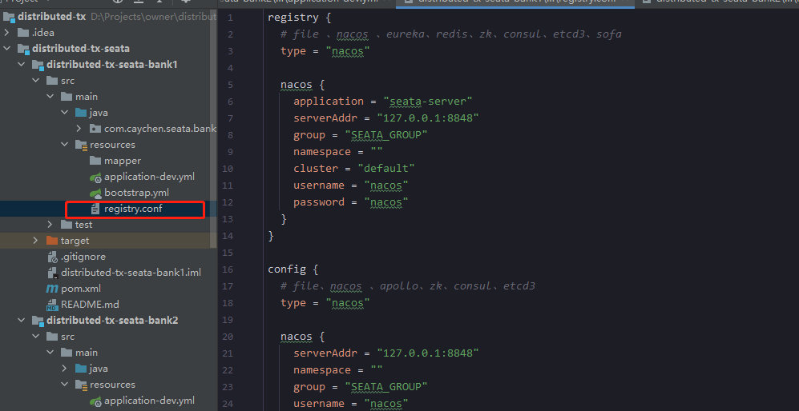


##### 3.1.3.7、添加seata依赖

```xml
<dependency>
    <groupId>com.alibaba.cloud</groupId>
    <artifactId>spring-cloud-starter-alibaba-seata</artifactId>
    <exclusions>
        <exclusion>
            <groupId>io.seata</groupId>
            <artifactId>seata-spring-boot-starter</artifactId>
        </exclusion>
    </exclusions>
</dependency>

<dependency>
    <groupId>io.seata</groupId>
    <artifactId>seata-spring-boot-starter</artifactId>
    <version>1.3.0</version>
</dependency>
```


##### 3.1.3.8、修改bootstrap.yml 

```yaml
#添加事务组
spring:
  cloud:
	alibaba:
	  seata:
		# 事务分组配置
		tx-service-group: my_test_tx_group
```


### 3PC（三阶段提交）

三阶段提交又称3PC，相对于2PC来说增加了CanCommit阶段和超时机制。如果一段时间内没有收到协调者的commit请求，那么就会自动进行commit，解决了2PC单点故障的问题。

但是性能问题和不一致问题仍然没有根本解决。下面我们还是一起看下三阶段流程的是什么样的？

- 第一阶段：**「CanCommit阶段」**这个阶段所做的事很简单，就是协调者询问事务参与者，你是否有能力完成此次事务。
  - 如果都返回yes，则进入第二阶段
  - 有一个返回no或等待响应超时，则中断事务，并向所有参与者发送abort请求
- 第二阶段：**「PreCommit阶段」**此时协调者会向所有的参与者发送PreCommit请求，参与者收到后开始执行事务操作，并将Undo和Redo信息记录到事务日志中。参与者执行完事务操作后（此时属于未提交事务的状态），就会向协调者反馈“Ack”表示我已经准备好提交了，并等待协调者的下一步指令。
- 第三阶段：**「DoCommit阶段」**在阶段二中，如果所有的参与者节点都可以进行PreCommit提交，那么协调者就会从“预提交状态”转变为“提交状态”。然后向所有的参与者节点发送"doCommit"请求，参与者节点在收到提交请求后就会各自执行事务提交操作，并向协调者节点反馈“Ack”消息，协调者收到所有参与者的Ack消息后完成事务。相反，如果有一个参与者节点未完成PreCommit的反馈或者反馈超时，那么协调者都会向所有的参与者节点发送abort请求，从而中断事务。


### TCC事务补偿

#### 理论

TCC 将事务提交分为 Try - Confirm - Cancel 3个操作。其和两阶段提交有点类似，Try为第一阶段，Confirm - Cancel为第二阶段，是一种**应用层面侵入业务的两阶段提交**。

其核心思想是：**「针对每个操作，都要注册一个与其对应的确认和补偿（撤销）操作」**。它分为三个阶段：

**「Try,Confirm,Cancel」**

- Try阶段主要是对**「业务系统做检测及资源预留」**，接下来又有两个阶段：
  - Confirm 阶段主要是对**「业务系统做确认提交」**，Try阶段执行成功并开始执行 Confirm阶段时，默认 Confirm阶段是不会出错的。即：只要Try成功，Confirm一定成功。
  - Cancel 阶段主要是在业务执行错误，需要回滚的状态下执行的业务取消，**「预留资源释放和撤销」**。


比如下一个订单减一个库存：

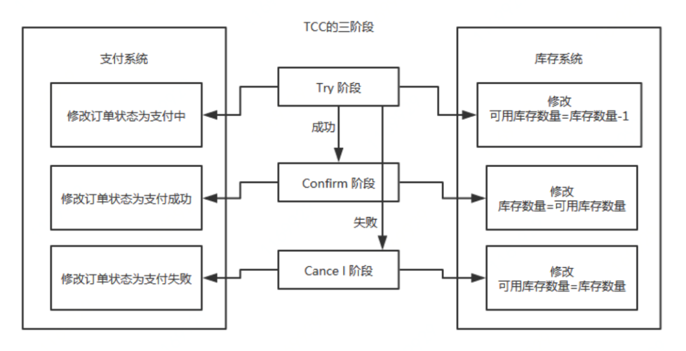

执行流程：

- Try阶段：订单系统将当前订单状态设置为支付中，库存系统校验当前剩余库存数量是否大于1，然后将可用库存数量设置为库存剩余数量减1，
  - 如果Try阶段**「执行成功」**，则执行**Confirm**阶段，将订单状态修改为支付成功，库存剩余数量修改为可用库存数量；
  - 如果Try阶段**「执行失败」**，则执行**Cancel**阶段，将订单状态修改为支付失败，可用库存数量修改为库存剩余数量；

TCC 事务机制相比于上面介绍的2PC，解决了其几个缺点：

- 1.**「解决了协调者单点」**，由主业务方发起并完成这个业务活动。业务活动管理器也变成多点，引入集群。
- 2.**「同步阻塞」**：引入超时，超时后进行补偿，并且不会锁定整个资源，将资源转换为业务逻辑形式，粒度变小。
- 3.**「数据一致性」**，有了补偿机制之后，由业务活动管理器控制一致性。

总之，TCC 就是通过代码人为实现了两阶段提交，不同的业务场景所写的代码都不一样，并且很大程度的**「增加」**了业务代码的**「复杂度」**，因此，这种模式并不能很好地被复用。


#### TCC需要解决的问题

##### 1、**幂等控制**

使用TCC时要注意Try - Confirm - Cancel 3个操作的**幂等控制**，因为网络原因或者重试操作都有可能导致这几个操作的重复执行。

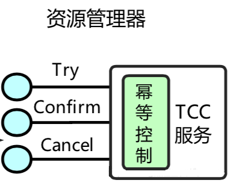

新建一张去重表，使用某些字段作为唯一建，若插入报错返回也是可以的，不管怎么样，核心就是保证，操作幂等性。


##### 2、**空回滚**

如下图所示，事务协调器在调用TCC服务的一阶段Try操作时，可能会出现因为丢包而导致的网络超时，此时事务协调器会触发二阶段回滚，调用TCC服务的Cancel操作；

TCC服务在未收到Try请求的情况下收到Cancel请求，这种场景被称为空回滚；TCC服务在实现时应当允许空回滚的执行；

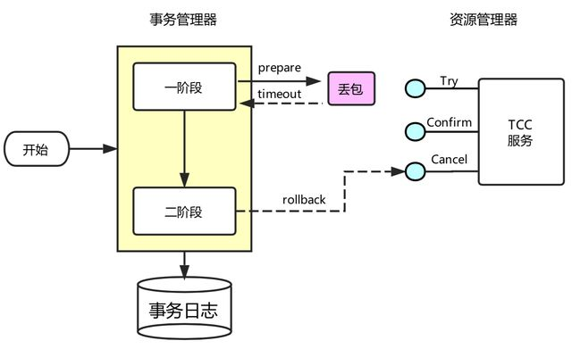

核心思想就是 **回滚请求处理时，如果对应的具体业务数据为空，则返回成功**

当然这种问题也可以通过中间件层面来实现，如，在第一阶段try()执行完后，向一张事务表中插入一条数据(包含事务id，分支id)，cancle()执行时，判断如果没有事务记录则直接返回，但是现在还不支持。


##### 3、**防悬挂**

如下图所示，事务协调器在调用TCC服务的一阶段Try操作时，可能会出现因网络拥堵而导致的超时，此时事务协调器会触发二阶段回滚，调用TCC服务的Cancel操作；在此之后，拥堵在网络上的一阶段Try数据包被TCC服务收到，出现了二阶段Cancel请求比一阶段Try请求先执行的情况；

用户在实现TCC服务时，应当允许空回滚，但是要拒绝执行空回滚之后到来的一阶段Try请求；

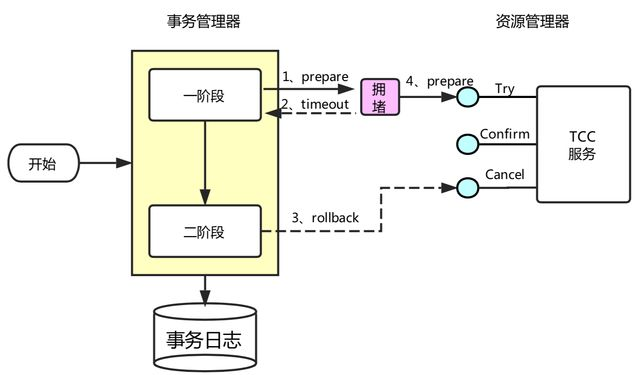

这里又怎么做呢？

可以在二阶段执行时插入一条事务控制记录，状态为已回滚，这样当一阶段执行时，先读取该记录，如果记录存在，就认为二阶段回滚操作已经执行，不再执行try方法。


### 本地消息表

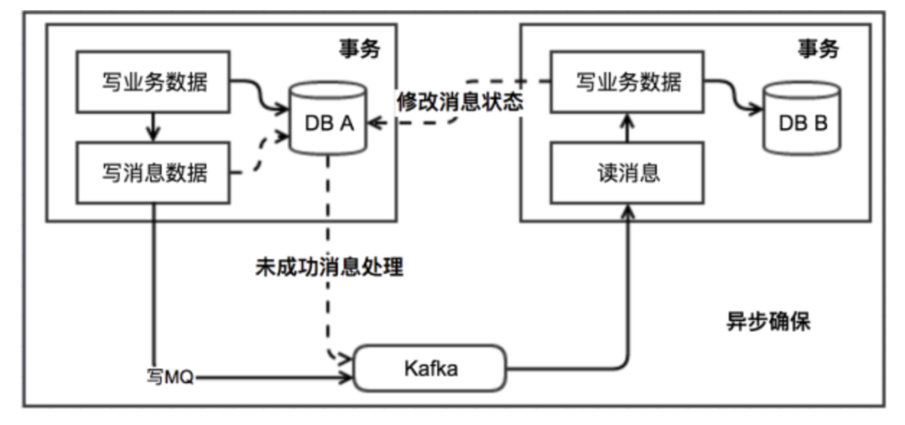

执行流程：

- 消息生产方，需要额外建一个消息表，并**「记录消息发送状态」**。消息表和业务数据要在一个事务里提交，也就是说他们要在一个数据库里面。然后消息会经过MQ发送到消息的消费方。

- - 如果消息发送失败，会进行重试发送。

- 消息消费方，需要**「处理」**这个**「消息」**，并完成自己的业务逻辑。

- - 如果是**「业务上面的失败」**，可以给生产方**「发送一个业务补偿消息」**，通知生产方进行回滚等操作。

  - 此时如果本地事务处理成功，表明已经处理成功了
  - 如果处理失败，那么就会重试执行。

- 生产方和消费方定时扫描本地消息表，把还没处理完成的消息或者失败的消息再发送一遍。


### 基于可靠消息的最终一致性方案概述（消息事务）

消息事务的原理是将两个事务**「通过消息中间件进行异步解耦」**，和上述的本地消息表有点类似，但是是通过消息中间件的机制去做的，其本质就是'将本地消息表封装到了消息中间件中'。

执行流程：

- 发送prepare消息到消息中间件
- 发送成功后，执行本地事务
- - 如果事务执行成功，则commit，消息中间件将消息下发至消费端
  - 如果事务执行失败，则回滚，消息中间件将这条prepare消息删除
- 消费端接收到消息进行消费，如果消费失败，则不断重试

这种方案也是实现了**「最终一致性」**，对比本地消息表实现方案，不需要再建消息表，**「不再依赖本地数据库事务」**了，所以这种方案更适用于高并发的场景。目前市面上实现该方案的**「只有阿里的 RocketMQ」**。


### 最大努力通知

最大努力通知的方案实现比较简单，适用于一些最终一致性要求较低的业务。

执行流程：

- 系统 A 本地事务执行完之后，发送个消息到 MQ；
- 这里会有个专门消费 MQ 的服务，这个服务会消费 MQ 并调用系统 B 的接口；
- 要是系统 B 执行成功就 ok 了；要是系统 B 执行失败了，那么最大努力通知服务就定时尝试重新调用系统 B, 反复 N 次，最后还是不行就放弃。


## 4、总结

